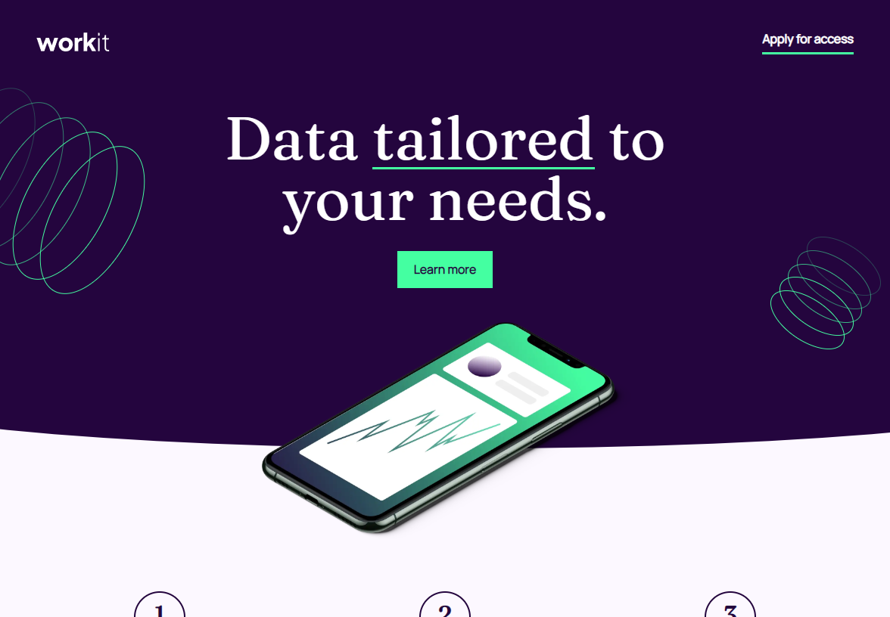

# Frontend Mentor - QR code component solution

This is a solution to the [Workit landing page challenge on Frontend Mentor](https://www.frontendmentor.io/challenges/workit-landing-page-2fYnyle5lu). Frontend Mentor challenges help you improve your coding skills by building realistic projects. 

## Table of contents

- [Overview](#overview)
  - [Screenshot](#screenshot)
  - [Links](#links)
- [My process](#my-process)
  - [Built with](#built-with)
  - [What I learned](#what-i-learned)

## Overview

### Screenshot

### Links

- Live Site URL: [Workit landing page challenge](https://vinhtran144.github.io/workit-landing-page/?fbclid=IwAR3mzsKiVf71qWqyv8P2PjSjyxQiYPFl-1G8yIjIsykDI5C48KazXVvGk1I)

## My process

### Built with

- Stylus
- [Custom Shape Divider](https://www.shapedivider.app/) 

### What I learned

This is a really challenging project for me. I have been abusing frontend libraries like bootstrap, so this is my first time dealing with media queries, as well as positioning components to it's position. Stylus really help a lot with writing the code and nesting in the media queries, so I was able to save a lot of time.

I'm pretty proud that I was able to write css without and library. I hope my work flow will be faster as I get used to doing CSS. 